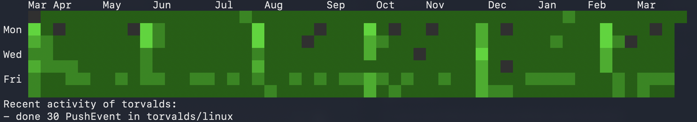

# ghtrack

CLI tool to track GitHub activity and contribution graph from terminal.

## Features

- 📊 Contribution graph in terminal
- 📈 Recent activity summary
- ⚡ Fast and lightweight (uses httpx + scraping)

## Installation

### From GitHub

```bash
pip install git+https://github.com/kuryletso/ghtrack.git
```

### Local Development

```bash
git clone https://github.com/kuryletso/ghtrack.git
cd ghtrack
uv pip install -e .
```

## Usage
```bash
ghtrack <username>
```

### Options
```bash
ghtrack <username> -g         # graph only
ghtrack <username> -a         # activity only
ghtrack <username> -a --json  # activity as json object
```

### Example
```bash
ghtrack torvalds
```

## Tech Stack
* Python
* httpx
* BeautifulSoup

## License
MIT
